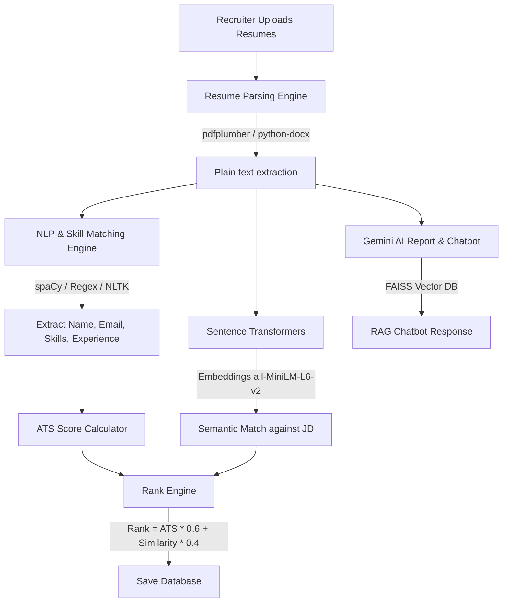

# TalentAI – AI-Powered Resume Screening & Candidate Ranking Platform

TalentAI is an industry-grade, enterprise SaaS platform designed for recruiters and hiring managers. It automatically parses multiple candidate resumes (PDF/DOCX), extracts skills and experience, computes a precise ATS score, performs semantic similarity matching using vector embeddings, caches AI summaries/interview prep guides via Gemini, and exposes an interactive RAG chatbot to query candidate resumes.

---

## Technical Stack

* **Backend**: Python, FastAPI, SQLAlchemy
* **Database**: PostgreSQL (Docker) / SQLite (Local Dev fallback)
* **NLP & ML**: spaCy, NLTK, Sentence Transformers (`all-MiniLM-L6-v2`)
* **AI & Search**: Gemini API (`gemini-1.5-flash`), FAISS Vector Database, LangChain
* **File Parsing**: `pdfplumber`, `PyPDF2`, `python-docx`
* **Frontend**: React, Tailwind CSS, Recharts, Lucide Icons, Vite
* **Deployment**: Docker, Docker Compose

---

## Architectural Workflow



---

## Environment Variables Checklist

Create a `.env` file in the root directory before launching:

```bash
# Gemini API Key (Required for AI Evaluation, Skill Gap, Interview Prep, RAG Chat)
GEMINI_API_KEY=your_gemini_api_key_here

# JWT Security Key
JWT_SECRET=supersecretkeytalentai1234567890!@#

# Database (Automatically set inside docker-compose, defaults to sqlite:///./talentai.db locally)
DATABASE_URL=postgresql://postgres:postgrespassword123@db:5432/talentai
```

---

## Getting Started (Quick Start)

### Option A: Running via Docker (Recommended)

1. Ensure **Docker** and **Docker Compose** are installed and running.
2. In the project root, create a `.env` file and define `GEMINI_API_KEY`.
3. Build and launch the container ecosystem:
   ```bash
   docker-compose up --build
   ```
4. Access the web interface at **`http://localhost:5173`**.
5. The backend APIs will be exposed at **`http://localhost:8000`**.

### Option B: Local Setup (Without Docker)

#### 1. Backend Setup
1. Navigate to the `/backend` folder:
   ```bash
   cd backend
   ```
2. Create and activate a Python virtual environment:
   ```bash
   python -m venv venv
   # On Windows:
   .\venv\Scripts\activate
   # On macOS/Linux:
   source venv/bin/activate
   ```
3. Install dependencies:
   ```bash
   pip install -r requirements.txt
   ```
4. Run the database seeder to inject sample recruiter logins, jobs, and candidate evaluation reports:
   ```bash
   python seed.py
   ```
5. Start the FastAPI development server:
   ```bash
   uvicorn main:app --reload --port 8000
   ```

#### 2. Frontend Setup
1. Open a new terminal and navigate to the `/frontend` folder:
   ```bash
   cd frontend
   ```
2. Install npm dependencies:
   ```bash
   npm install
   ```
3. Run the Vite development server:
   ```bash
   npm run dev
   ```
4. Open your browser and navigate to **`http://localhost:5173`**.

---

## Default Seeder Credentials

To log in immediately and inspect the pre-loaded data, use these credentials on the login screen:
* **Recruiter Login**:
  * **Email**: `recruiter@talentai.com`
  * **Password**: `recruiter123`
* **Admin Login**:
  * **Email**: `admin@talentai.com`
  * **Password**: `admin123`

---

## Core Scoring Systems

### 1. ATS Score (50% Skills + 20% Experience + 20% Projects + 10% Education)
* **Skill Match (50%)**: Proportional match based on candidate skills overlapping with required skills (40 points) and preferred skills (10 points).
* **Experience Match (20%)**: Proportional calculation: $\min\left(20, \frac{\text{Candidate Exp}}{\text{Required Exp}} \times 20\right)$.
* **Projects Match (20%)**: Checks for detailed project sections, indexing bullet lists. 3+ projects score 20 points, 2 score 15, 1 scores 10.
* **Education Match (10%)**: Dynamic hierarchy matching (PhD: 10, Master's: 9, Bachelor's: 8, Associate: 6).

### 2. Semantic Similarity Score
Uses Hugging Face's `all-MiniLM-L6-v2` locally to map the job description and the raw parsed resume text to dense vectors. Similarity is computed as the Cosine Similarity percentage.

### 3. Final Candidate Ranking
$$\text{Final Score} = (\text{ATS Score} \times 0.6) + (\text{Semantic Similarity Score} \times 0.4)$$
Candidates are ranked dynamically in descending order.

---

## API Documentation Reference

| Method | Endpoint | Description | Auth Required |
| :--- | :--- | :--- | :--- |
| **POST** | `/api/auth/signup` | Registers a new user account (Admin/Recruiter) | No |
| **POST** | `/api/auth/login` | Authenticates credentials and returns JWT token | No |
| **GET** | `/api/auth/me` | Returns current user details | Yes (Bearer Token) |
| **GET** | `/api/jobs` | Lists all active job screening roles | Yes |
| **POST** | `/api/jobs` | Creates a new Job Description profile | Yes (Recruiter/Admin) |
| **DELETE**| `/api/jobs/{id}` | Deletes job description and associated data | Yes (Recruiter/Admin) |
| **POST** | `/api/jobs/{id}/upload` | Uploads multiple PDF/DOCX resumes (Batch screen) | Yes (Recruiter/Admin) |
| **GET** | `/api/jobs/{id}/candidates` | Returns sorted ranked leaderboard of candidates | Yes |
| **GET** | `/api/candidates/{id}/evaluation/{job_id}` | Retrieves detailed ATS breakdown, gap analyses, and prep questions | Yes |
| **POST** | `/api/candidates/{id}/chat` | Queries the candidate resume FAISS vector database | Yes |
| **GET** | `/api/analytics` | Returns aggregated metrics for the dashboard | Yes |
